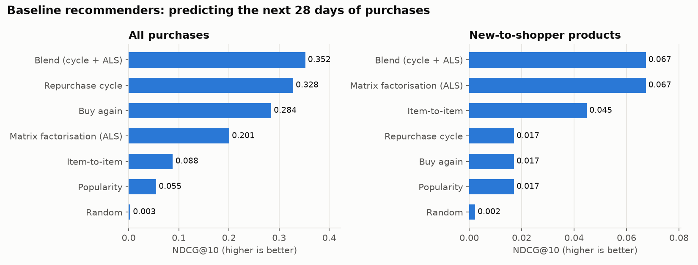
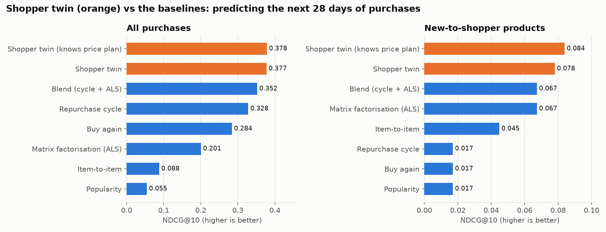
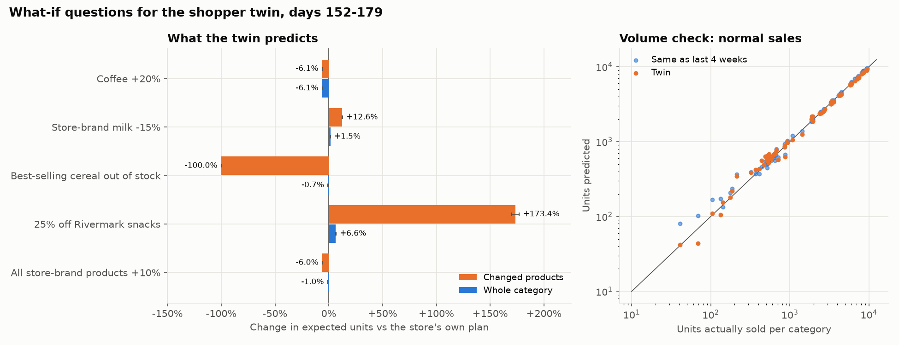

# Shopper Digital Twin

Predict what every customer would buy **before** a change happens.

Each shopper in a simulated Walmart-style general store gets a "twin", learned only from their browsing and purchase history. The twins are run forward in a simulator to answer what-if questions: *What happens to demand if this price goes up 10%? Where do shoppers go if this product is out of stock? Who buys the new product?*

Because the store and its shoppers are generated, every shopper's true tastes and price sensitivity are known. That makes it possible to check the twins' what-if forecasts against the real answer, something retailers can never do.

## Quick start

```bash
python -m venv .venv
source .venv/bin/activate          # Windows (Git Bash): source .venv/Scripts/activate
pip install -e ".[dev]"

python scripts/generate_world.py --preset small     # 10k shoppers, 180 days, ~10M events (~30 s)
python scripts/inspect_world.py --world data/worlds/small
python scripts/run_baselines.py --world data/worlds/small   # tune and score the baselines (~10 min)
python scripts/run_twin.py --world data/worlds/small        # fit and score the shopper twin (~5 min)
python scripts/run_whatif.py --world data/worlds/small      # ask the twin five what-if questions (~2 min)
pytest
```

Or run every stage in order, skipping the ones already done: `python scripts/run_all.py`.

Presets: `tiny` (1k shoppers, 60 days), `small` (10k shoppers, 180 days), `full` (100k shoppers, 180 days, ~100M events).

## How it works

- **Synthetic world** (`src/shopper_twin/world/`): a general store with 81 categories across 13 departments, ~5k products, and shoppers from six hidden segments. Every shopper has a sealed answer key of true parameters: taste, price sensitivity, quality preference, brand loyalty, habits, pets, kids, repurchase cycles.
- **Twin model** (`src/shopper_twin/twin/`): for every shopper, *when* they shop each category and *what* they pick there.
  - Which products catch their eye on a trip (a ranking model over the category's products).
  - Which one they buy, or nothing: `appeal = taste match + habit + store-brand liking + brand loyalty + promotion - price sensitivity x log(price)`, against a "buy nothing" option.
  - How many trips they'll make to each category in the next 4 weeks (a small neural network trained on their own history).
  - Every shopper's numbers are pulled towards the average of shoppers like them (same age band and household size), so shoppers with little history still get sensible values.
  - Getting the totals right, not just the order: the chance of buying averages over which products a shopper might look at, using a second-order formula checked against simulation, and each category's totals are then checked against the 4 weeks before the cutoff. Predicted sales went from 7% too low to 1.5% too low, without changing how strongly shoppers react to prices.
- **What-if engine:** change prices, run a promotion or take products off the shelf, and ask every twin what they would buy instead, compared with the store's own plan.
- **Evaluation:** next-purchase accuracy against strong baselines, then the what-if forecasts against the hidden true store re-run under the same change, parameter recovery, calibration and speed.
- **Demo:** Streamlit app with a price slider and a chat to interview any twin.

## Does the fake store behave like a real one?

From `scripts/inspect_world.py` on the `small` preset (10k shoppers, 180 days):

| Check | Result |
|---|---|
| Average basket | 3.7 items, $49.50 |
| Grocery share of purchases | 66% |
| Weekend vs. weekday revenue | 1.48x |
| Staple repurchase timing vs. design | log correlation 0.997 |
| Store-brand share, least vs. most price-sensitive shoppers | 15% vs. 57% |
| Coffee +40% price (what-if test, 2k shoppers, 3 seeds) | 11-16% fewer units sold |

## How good are the baselines?

The twin has to beat these. From `scripts/run_baselines.py` on the `small` preset: each model is tuned on days 124-151, then scored once on days 152-179 (9,569 shoppers). The score is NDCG@10, where 1.0 means a perfect top-10 list.

| Model | All purchases | New-to-shopper products |
|---|---|---|
| Blend (repurchase cycle + ALS) | **0.351** | **0.067** |
| Repurchase cycle | 0.328 | 0.017 |
| Buy again | 0.284 | 0.017 |
| Matrix factorisation (ALS) | 0.202 | **0.067** |
| Item-to-item | 0.088 | 0.045 |
| Popularity | 0.055 | 0.017 |
| Random | 0.003 | 0.002 |

Most of what people buy in a general store is a repeat, so models built on each shopper's own history lead on all purchases. The repurchase-cycle model, which also knows when each shopper is due to restock, gets at least one of its top 10 right for 92% of shoppers. Products a shopper has never bought are much harder. There ALS leads, with at least one hit for 41% of shoppers, and the tuned blend puts all its weight on it.



## How good is the twin?

Same test as the baselines: trained on days 0-151, scored on days 152-179 (9,569 shoppers), NDCG@10.

| Model | All purchases | New-to-shopper products |
|---|---|---|
| **Shopper twin** | **0.377** | **0.078** |
| Shopper twin + the store's price plan | 0.378 | 0.084 |
| Blend (repurchase cycle + ALS), best baseline | 0.351 | 0.067 |
| Matrix factorisation (ALS) | 0.202 | 0.067 |

The twin beats the best baseline by 7% on all purchases and by 16% on products a shopper has never bought. "Shopper twin" knows only what happened before day 152, exactly like the baselines. The second row also uses the store's own price and promotion calendar for the 4 weeks ahead, which a store always knows but the baselines can't use. 12% of the purchases in those 4 weeks were products on promotion.



**How to read these results.** The twin uses the same kind of model as the simulated store (shoppers look at a few products, then pick the best one or nothing). So these numbers show how well the right kind of model can learn each shopper from their behaviour alone; real shoppers are messier. Some parts don't match the store's hidden rules: brand loyalty is estimated from past brand choices (the store uses a hidden favourite brand), trip timing is learned by a neural network rather than the store's due-date rule, and tastes are treated as fixed while the store's drift slowly.

## What if...?

The fitted twin (trained on days 0-151) answers five questions about days 152-179, each compared with the store's own price plan for those 4 weeks. From `scripts/run_whatif.py`:

| Scenario | Changed products' units | Whole category's units | Category revenue |
|---|---|---|---|
| Coffee +20% | -6.1% | -6.1% | +12.4% |
| Store-brand milk -15% | +12.5% | +1.5% | -4.4% |
| Best-selling cereal out of stock | -100% | -0.7% | +0.8% |
| 25% off the most popular snack brand | +173% | +6.5% | +2.6% |
| All store-brand products +10% | -6.0% | -1.0% | +1.7% |



How to read it: a 20% dearer coffee loses 6% of its sales, all of them to "buy nothing" because every coffee got dearer, so revenue still rises 12%. Cheaper store-brand milk sells 12.5% more, but two thirds of that is taken from other milk brands, so the category only grows 1.5% and its revenue falls. When the best-selling cereal is out of stock, 89% of its sales move to other cereals. `reports/small/whatif.md` also shows which products gain, and how different households react.

These are the twin's predictions. The simulated store can be re-run with the same change to get the true answer, which is what milestone 5 does. Before trusting the answers, the report checks the twin's normal sales: with no change, it predicts 229,371 units in the 4 weeks against 232,862 really sold (1.5% low; 3.6% average error per category).

## Project structure

```
src/shopper_twin/world/      fake store generator (spec, catalogue, population, simulator, saving)
src/shopper_twin/data.py     loads a world's public data only (never the answer key)
src/shopper_twin/eval/       time-based splits, ranking metrics, scoring and tuning harness
src/shopper_twin/baselines/  popularity, buy again, repurchase cycle, item-to-item, ALS, blend
src/shopper_twin/twin/       the shopper twin: trips, choice model, trip-rate model, predictions
src/shopper_twin/sim/        what-if scenarios (price changes, promotions, stock-outs) asked of the twin
scripts/                     command-line entry points (run_all.py runs everything)
tests/                       pytest checks
data/                        generated worlds (git-ignored)
models/                      fitted twins (git-ignored)
reports/                     sanity-check charts, baseline, twin and what-if results
```

## Status

- [x] Milestone 1: synthetic world generator
- [x] Milestone 2: baseline recommenders and evaluation harness
- [x] Milestone 3: twin model v1
- [x] Milestone 4: what-if engine
- [ ] Milestone 5: evaluation against the hidden answer key
- [ ] Milestone 6: upgrades (skipped items bought later, life events)
- [ ] Milestone 7: demo app
- [ ] Milestone 8: write-up

Built in Python.
